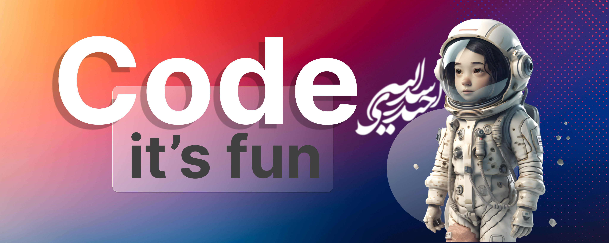

<h1 align="center">
    
</h1>

<h3 align="center">Software Engineer and Web Developer</h3>

 

 
 
 

    I am full of both successful and unsuccessful efforts, each of which has shaped me in some way. I have never lost hope and will not give up. I continue on my path with strength through all the difficulties and reach for my desires. Maybe today is not the day, but I strive for a better tomorrow.
    My interest in learning, creating and inventing new things led me towards programming, and my keen interest in colors and design transformed me into a front-end developer. Along this career path, I have tried to acquire familiarity with other soft and hard skills that I needed

 

 
  
  
  <!-- <a href="" target="_blank">
      <!-- sqlite, safari, google-chrome are other good icon options -->
  </a> 

 

 
<h2 align="center">Languages-Frameworks-Tools</h2>
 

     
    

 

<!-- <h2 align="center">⚡ Stats ⚡</h2> -->

<!--   -->

<!-- 

  
  
   
  

 -->

<!--   -->
<!--   -->

<!--  -->

<!-- 
 -->
<!--   -->
